# Checking for Voting Machine Fraud in the State of Oklahoma

This checks for patterns between voter turnout and age in Oklahoma in the 2020 General Presidential Election.

## Results

The following are predictions vs. actual votes cast for the 5 largest counties in Oklahoma.

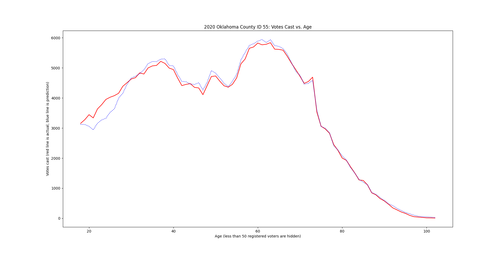
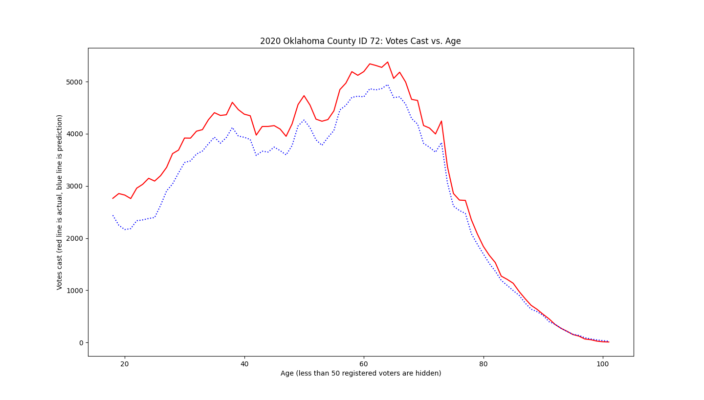
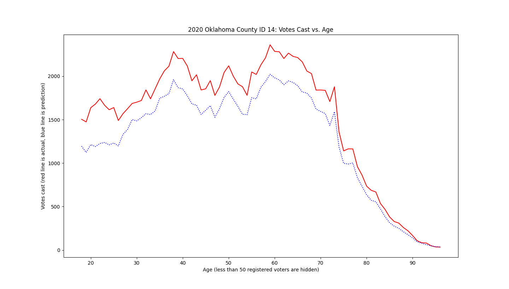
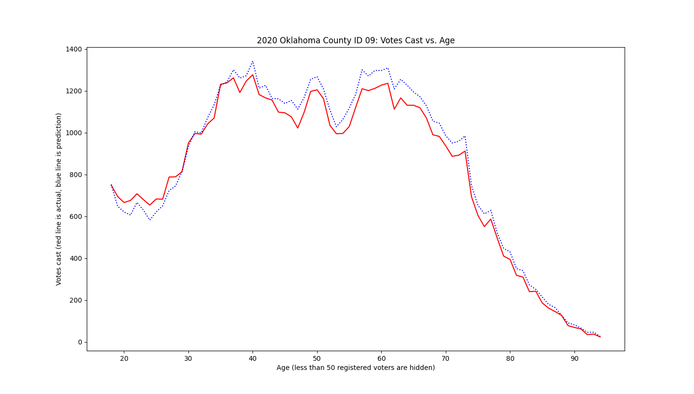
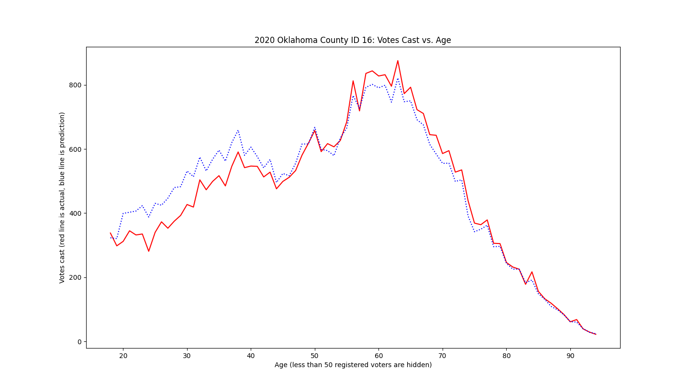

Note that between 2008 and 2012, voting machines were changed. Note that all of the following plots used the 2020 voter roll.

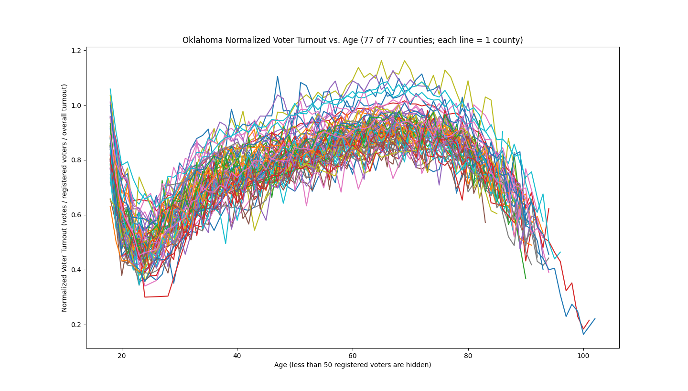
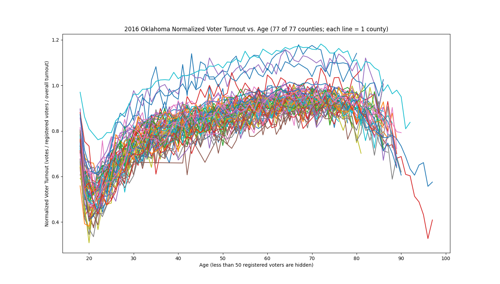
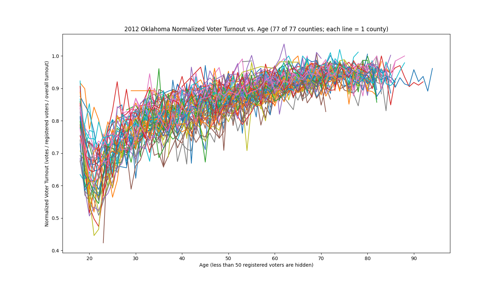
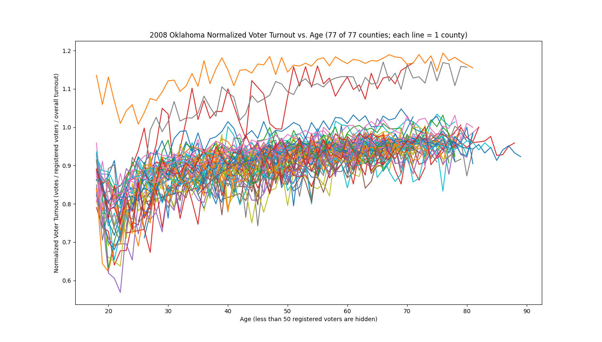
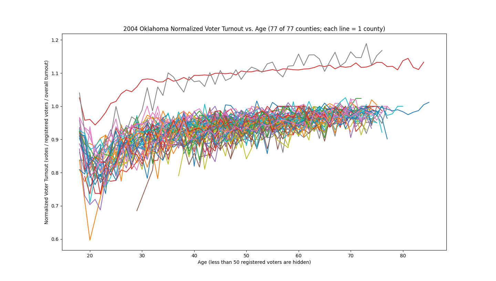
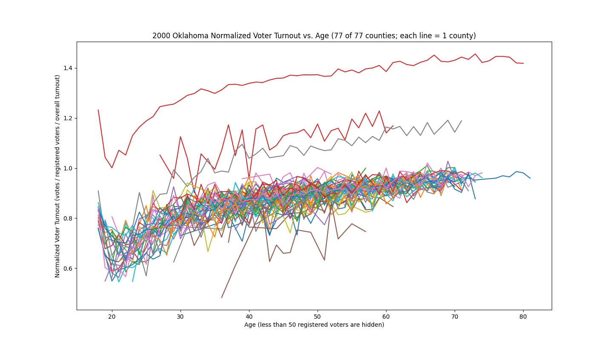

## Setup

Requires python3.

## Running

1. Obtain voter list. See Data Source.
2. Move and rename the voter registry folder to `./voter_database/registered_voters`
3. Move and rename the voter history folder to `./voter_database/voter_history`
4. Plot voter turnout lines vs. age for all counties on the same plot: `./plot_turnout_by_age.py`
    For county ID list, see `readme.pdf` inside the registered voters folder.

## Data source

The data is free, but you must first request access: https://oklahoma.gov/elections/candidate-info/voter-list.html

File size is about 2 GB for voters and vote histories for all 77 counties in Oklahoma.

